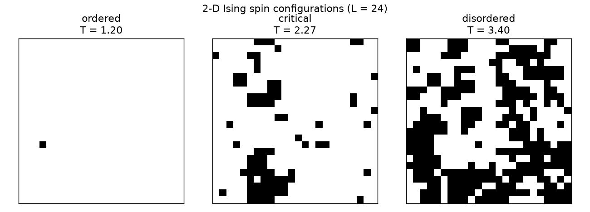
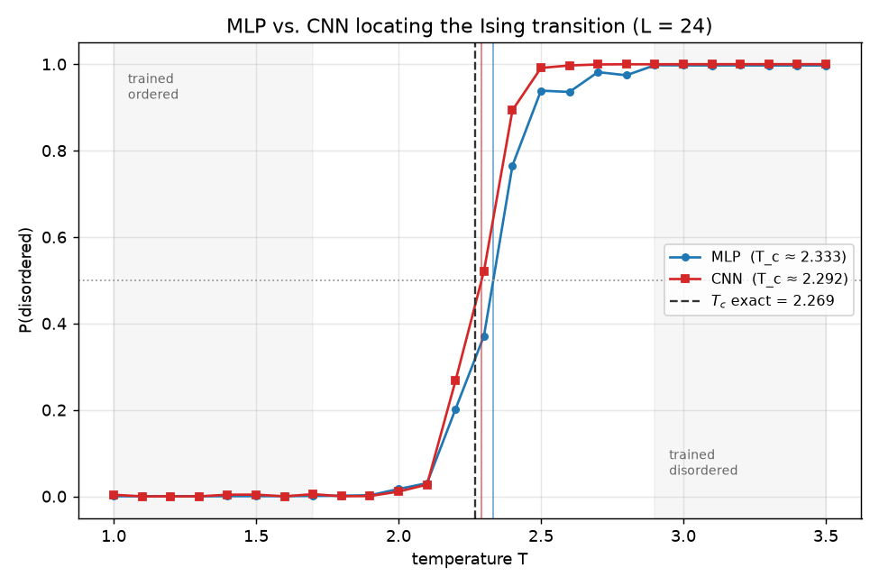
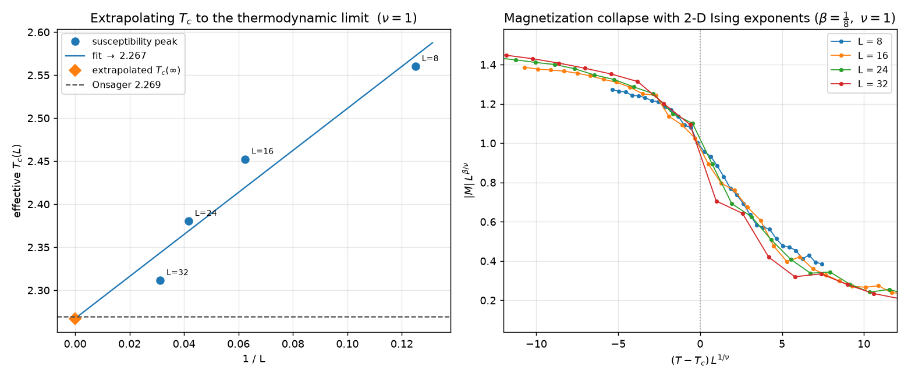
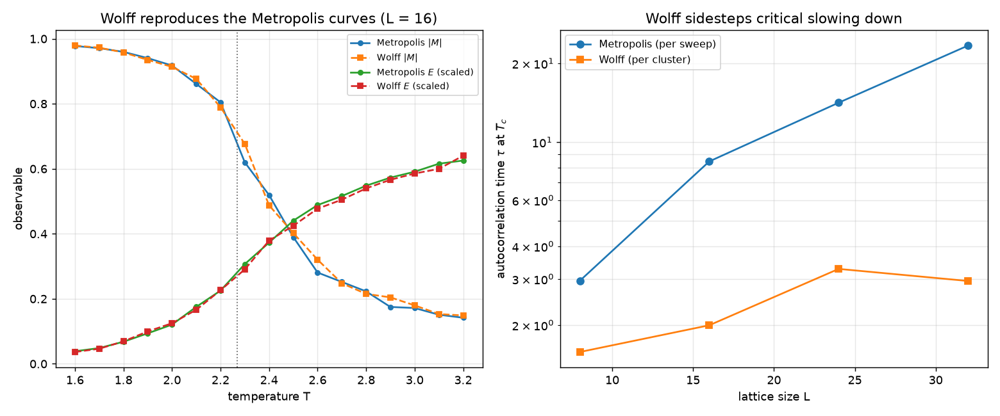

# ml-ising-phases

**Can a neural network discover a phase transition it was never told about?**
Yes — this project reproduces the central result of Carrasquilla & Melko,
*Machine learning phases of matter* (Nature Physics, 2017), end to end:

1. **Simulate** the 2-D Ising model with a vectorized Metropolis Monte Carlo.
2. **Train** a small neural net to tell *ordered* from *disordered* using only
   configurations drawn **deep** in each phase (no knowledge of `T_c`).
3. **Recover `T_c`**: ask the network about the critical region it never saw —
   its `P(disordered)` output crosses ½ within **2.8%** of the exact Onsager
   value `T_c = 2/ln(1+√2) ≈ 2.269`.


It then pushes past the original result: a **convolutional** classifier that
reads the raw lattice and recovers `T_c` to **1.0%**, a **finite-size scaling**
study that extrapolates `T_c` to the thermodynamic limit (0.1%) and confirms the
2-D Ising universality class by data collapse, and a **Wolff cluster** sampler
that sidesteps critical slowing down near `T_c`.

---

## Why this project

It connects three things I want to be good at: **statistical physics** (the
Ising model and critical phenomena), **scientific computing** (a fast,
vectorized Monte Carlo), and **machine learning** (training and interpreting a
classifier on real generated data). The result is genuinely surprising — the
network learns the order parameter on its own — which makes it a great vehicle
for showing the whole pipeline rather than a toy.

## The physics is right first

Before any ML, the Monte Carlo reproduces the transition from observables alone.
Magnetization collapses at `T_c`; susceptibility `χ` and specific heat `c` peak
there (`examples/physics_demo.py`, L = 24):

```
T_c (exact)               = 2.269
T_c (specific-heat peak)  = 2.262
T_c (susceptibility peak)  = 2.338
```


The configurations themselves tell the story — aligned below `T_c`, fractal-like
clusters *at* `T_c`, and random noise above it:



## Then the machine learns it

`examples/ml_demo.py` trains an MLP on the shaded regions only (deep ordered +
deep disordered) and predicts across the full range:

```
train accuracy (deep phases):     1.000
T_c estimate (P = 1/2 crossing):  2.333
T_c exact (Onsager):              2.269
relative error:                   2.8%
```

The network is never shown a configuration near `T_c`, yet its output crosses ½
right at the transition — it has learned the order parameter purely from the raw
spins.

## Does spatial structure help? CNN vs. MLP

The baseline MLP flattens the lattice and treats every spin as an independent
feature. A small **CNN** (two conv layers with *circular* padding — matching the
periodic boundaries — then a global average pool and a dense head) instead reads
the L×L configuration as an image and looks at it locally. Both are trained on
the *same* deep-phase configurations (`examples/cnn_demo.py`, L = 24):

```
L = 24    T_c (exact, Onsager) = 2.269
model     train acc   T_c est  rel err
MLP           1.000     2.333     2.8%
CNN           1.000     2.292     1.0%
```



Both nail the deep phases and cross ½ near `T_c`; the CNN lands a little closer
here. The honest reading isn't "convolutions rescue the problem" — the order
parameter `|M|` is a *global* quantity the MLP already picks up easily. The
striking part is that a **translation-invariant** network, which can only see the
lattice through local filters and a global average (it is even size-agnostic —
the same weights run on any L), recovers `T_c` just as well.

## Finite-size scaling: to the thermodynamic limit

A finite lattice has no true singularity — the susceptibility peak is rounded and
sits at an *effective* `T_c(L)` that drifts with size as
`T_c(L) = T_c(∞) + a·L^(−1/ν)` with `ν = 1`. Running L = 8, 16, 24, 32 and
extrapolating the peak locations to `1/L → 0` (`examples/scaling_demo.py`):

```
   L   T_c(L) [χ peak]
   8        2.560
  16        2.452
  24        2.380
  32        2.312

extrapolated T_c(∞) = 2.267    (Onsager 2.269, 0.1% off)
```



The right panel is a **data collapse**: rescaling magnetization as `|M|·L^(β/ν)`
against `(T−T_c)·L^(1/ν)` with the exact 2-D Ising exponents (`β = 1/8`,
`ν = 1`) drops all four sizes onto one universal curve. With the *wrong*
exponents the curves do not collapse (the spread is ~13× larger), pinning down
the universality class quantitatively rather than by eye.

## Beating critical slowing down: Wolff clusters

Right at `T_c` the Metropolis sweep stalls — correlated domains span the lattice
and single-spin flips barely move them, so the autocorrelation time diverges. The
**Wolff** algorithm (`ising/wolff.py`, pure NumPy) grows a correlated cluster and
flips it whole. It reproduces the same `M(T)` and `E(T)` curves, but its
autocorrelation time at `T_c` stays flat while Metropolis blows up
(`examples/wolff_demo.py`):

```
  L= 8   τ_Metropolis =  3.0 sweeps    τ_Wolff = 1.6 steps
  L=16   τ_Metropolis =  8.4 sweeps    τ_Wolff = 2.0 steps
  L=24   τ_Metropolis = 14.2 sweeps    τ_Wolff = 3.3 steps
  L=32   τ_Metropolis = 23.4 sweeps    τ_Wolff = 3.0 steps
```



(A cluster move and a full sweep are different units of work, so the absolute
numbers aren't a head-to-head speed. The point is the *scaling*: Wolff's `τ` stays
put as L grows, Metropolis's climbs — the signature of critical slowing down.)

## Quickstart

```bash
pip install -r requirements.txt    # numpy, scikit-learn, torch (CPU), matplotlib, pytest

python -m pytest -q                # 21 tests: physics + ML + scaling + Wolff
python examples/physics_demo.py    # observables vs T            (figure)
python examples/ml_demo.py         # train MLP + recover T_c     (figure)
python examples/cnn_demo.py        # CNN vs MLP comparison       (figure)
python examples/scaling_demo.py    # finite-size scaling + collapse (figure)
python examples/wolff_demo.py      # Wolff vs Metropolis         (figure)
```

The CPU build of PyTorch is plenty — see the CPU wheel index
(`pip install torch --index-url https://download.pytorch.org/whl/cpu`) for a much
smaller download, which is what CI uses.

### Use it

```python
from ising import montecarlo as mc

sim = mc.simulate(L=32, T=2.0, n_eq=1000, n_samples=100)
print(sim["abs_M"].mean())         # ~0.9 (ordered, below T_c)

from ising import compare
r = compare.compare(L=24)          # train MLP and CNN on one shared dataset
print(r["mlp"]["tc_estimate"], r["cnn"]["tc_estimate"])

from ising import scaling
scan = scaling.finite_size_scan(sizes=(8, 16, 24, 32))
print(scaling.extrapolate_tc(scan["sizes"], scan["tc_of_L"]))  # -> T_c(inf)
```

## How it works

**Monte Carlo.** Spins update by a **checkerboard** Metropolis sweep: the two
sublattices are conditionally independent (same-color sites are never
neighbors), so each color is flipped in one vectorized NumPy step using
`np.roll` for the periodic neighbor sums. Accept a flip with probability
`min(1, e^{-ΔE/T})`. The **Wolff** sampler instead grows a cluster from a random
seed, adding aligned neighbors with probability `1 − e^{−2/T}`, and flips the
whole cluster — one update decorrelates the configuration even at `T_c`.

**Learning.** Each L×L configuration is a `{−1,+1}` array. The **MLP** flattens
it and a single hidden layer represents the *nonlinear* order parameter `|M|` (a
linear classifier on raw spins cannot, which is itself a nice lesson). The **CNN**
keeps the lattice intact, convolves it with circular padding, and global-average-
pools — translation invariant by construction, and independent of `L`.

**Finding `T_c`.** Average `P(disordered)` over the samples at each temperature
and linearly interpolate the `P = ½` crossing. For the thermodynamic limit,
locate each lattice's susceptibility peak, then extrapolate `T_c(L)` linearly in
`1/L`.

## Project layout

```
ising/
  montecarlo.py   # Metropolis sweep, observables, thermodynamics()
  wolff.py        # Wolff cluster sampler + autocorrelation time
  dataset.py      # labeled configurations across temperatures
  model.py        # MLP baseline: train classifier, estimate T_c
  cnn.py          # small PyTorch CNN on the raw lattice
  compare.py      # fair MLP-vs-CNN head-to-head on one dataset
  scaling.py      # finite-size scaling + magnetization data collapse
examples/         # physics_, ml_, cnn_, scaling_, wolff_ demos (+ figures)
tests/            # 21 pytest checks
```

## References

- J. Carrasquilla & R. Melko (2017), *Machine learning phases of matter*,
  Nature Physics 13, 431.
- L. Onsager (1944), exact solution of the 2-D Ising model.
- U. Wolff (1989), *Collective Monte Carlo updating for spin systems*,
  Phys. Rev. Lett. 62, 361.
- K. Binder & D. Heermann, *Monte Carlo Simulation in Statistical Physics*.

## License

MIT — see [LICENSE](LICENSE).
</content>
